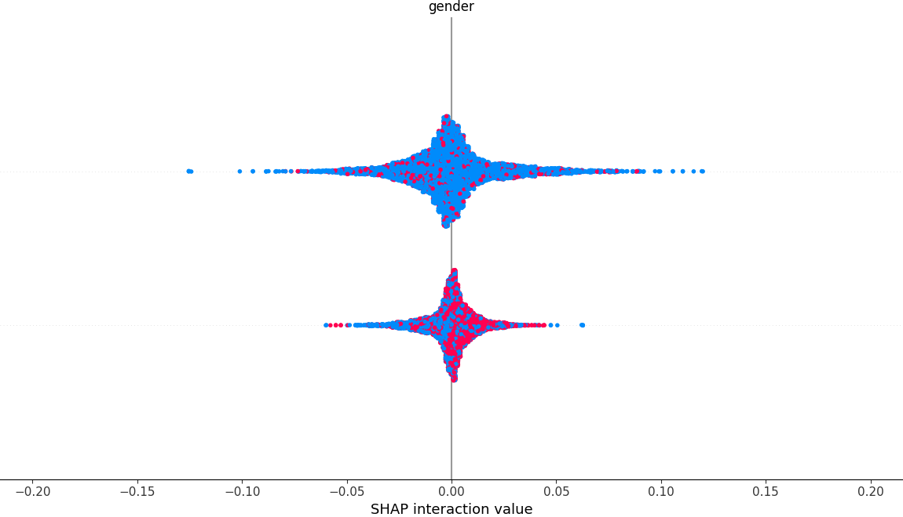

# Customer Churn Prediction Pipeline

This project implements an end-to-end machine learning pipeline to predict customer churn using the IBM Telco dataset. It includes multiple models, explainability via SHAP, model comparison, and a Streamlit app.

## Features
- Data ingestion & preprocessing
- Model selection (Random Forest, Logistic Regression, XGBoost)
- Cross-validation F1 score
- SHAP explainability (top features)
- Streamlit dashboard

## Setup
```bash
pip install -r requirements.txt
streamlit run app/app.py
```

## SHAP Explainability

The pipeline uses SHAP (SHapley Additive exPlanations) to interpret how individual features influence the model's predictions.

### SHAP Summary Plot

The SHAP summary plot below highlights the impact of the `gender` feature on model predictions:



**How to read the plot:**

- Each dot represents a customer instance.
- The x-axis shows the SHAP value, indicating how much the feature contributes to pushing the prediction toward churn (positive) or retention (negative).
- The color gradient represents the feature value (in this case, different encoded values for gender).
- Two dense vertical clusters suggest that the model treats two encoded gender values differently.
- A wider spread indicates a broader range of SHAP values (i.e., more variability in how the feature impacts predictions).

This plot provides insight into how the model is using the `gender` feature when making predictions, helping identify potential bias or areas for feature engineering.

## Author
George Paul
